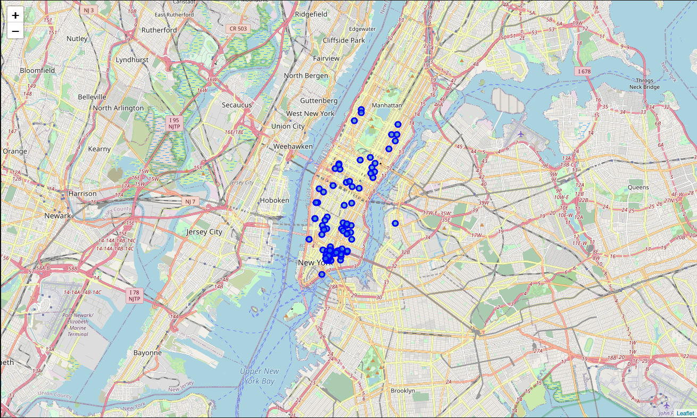
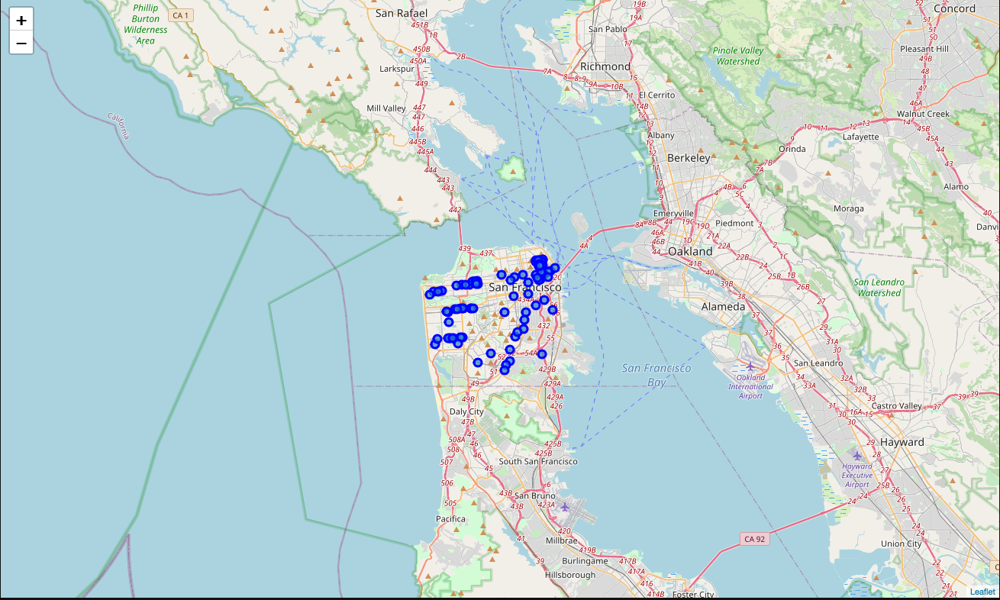
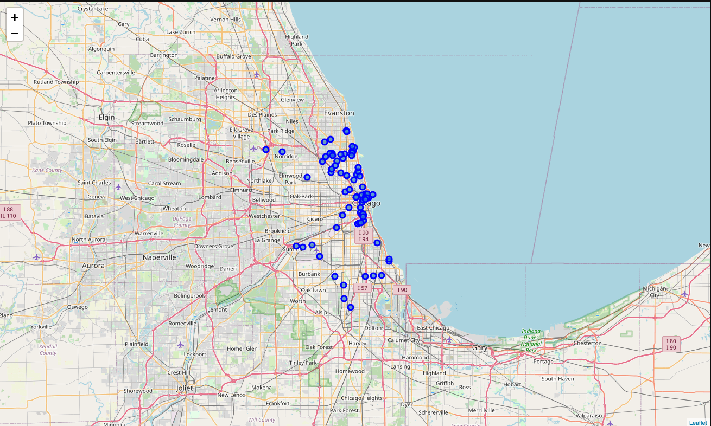
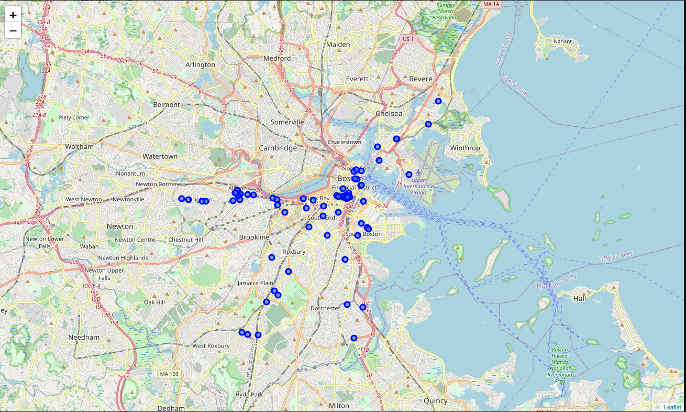
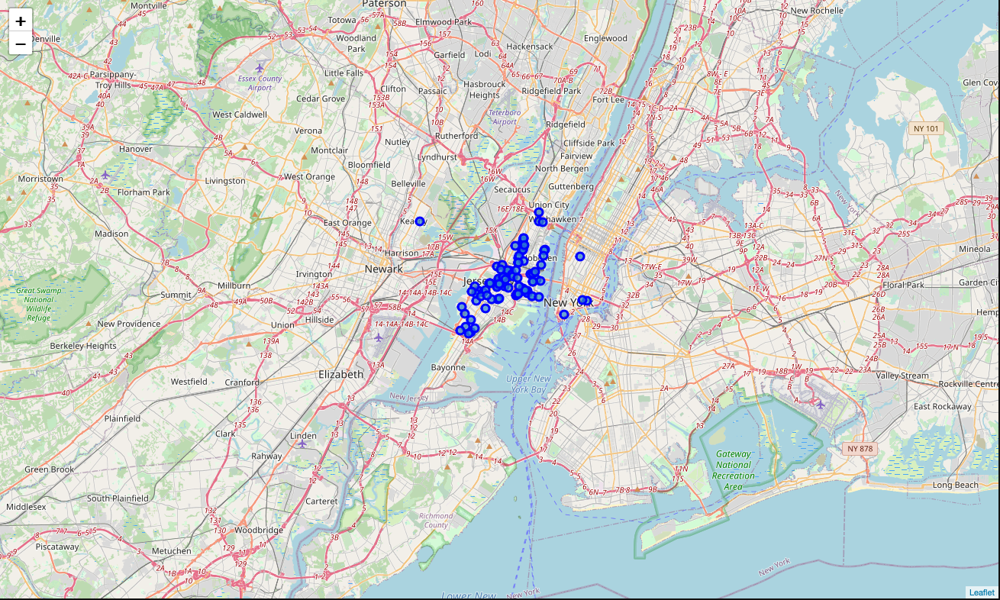
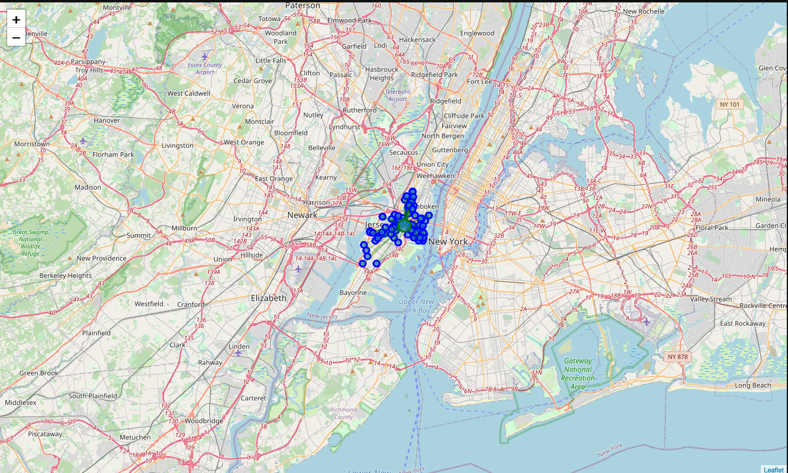
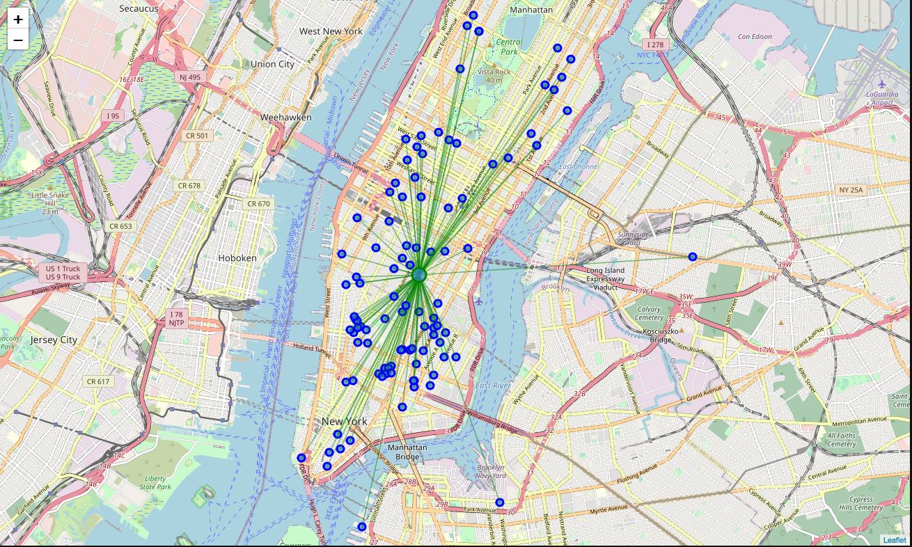
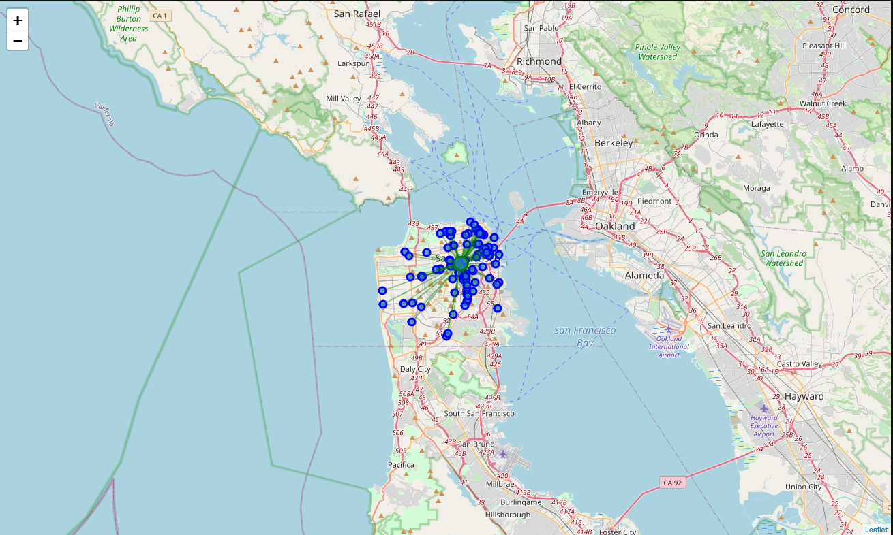
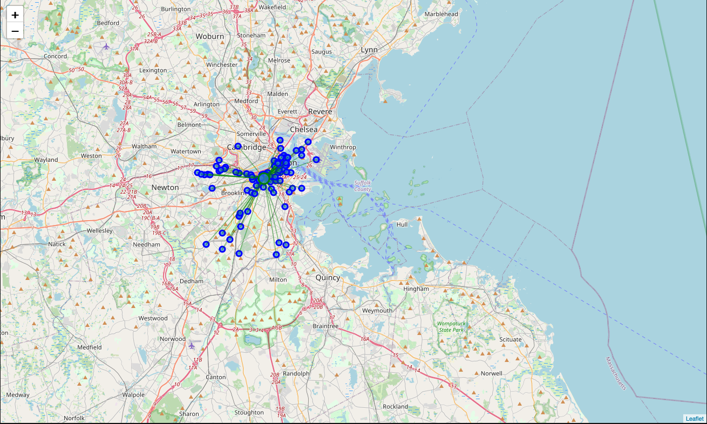
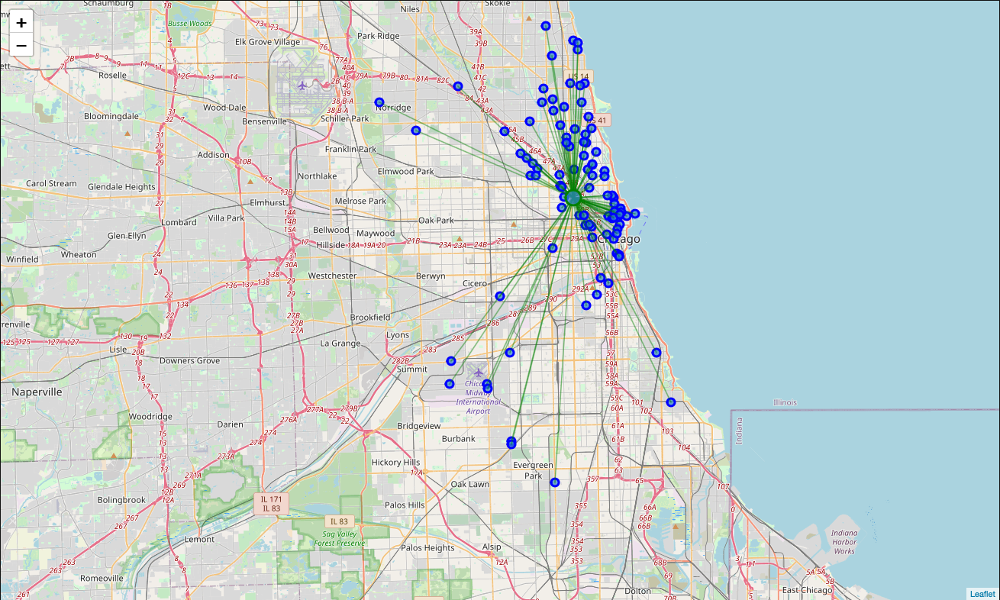

# Which city is more easy to find a Chinese Restaurant
Peer-graded Assignment: Capstone Project - The Battle of Neighborhoods (Week 2)

## Introduction

如果你会中文，看到这段文字一定会很亲切。今天想用在Coursera上学习到的一些Data Science的知识，借助Python解决一个中国人去美国，哪个城市更容易找到中餐馆呢？

Today, I want to use some of the data science knowledge I learned on Coursera, and use Python to solve a Chinese person going to the United States. Which city is easier to find a Chinese restaurant?  Let’s say if you are a Chinese and have never been to the US. The first question that you may wonder is which city maybe easy to find a Chinese Restaurant while you are there. So you want to go to a place with a high density of Chinese Restaurants around there. The solution is to analyze the locations of Chinese Restaurants in a few major US cities and find the best city which can easily find a good Chinese Restaurant. 

Also this solution could be a good reference for any tourists with a taste of eastern-style food.  This final project explores the locations for Chinese restaurants throughout New York, Chicago, San Francisco, Jersery City and Boston, all are very famous tourism cities and also many Chinese residents.  The project will attempt to answer the questions “Which city is more easy to find a Chinese Restaurant?"

## Data

The FourSquare API will be used to collect data of Chinese Restaurant locations in the following five major US cities, which are:
- New York, NY
- San Francisco, CA
- Jersey City, NJ
- Boston, MA
- Chicago, IL

These are one of the most populated US cities with many Chinese residents and also tourists.  Assuming there will be many good and even great Chinese Restaurants in these cities.

According to the categories information on https://developer.foursquare.com/docs/build-with-foursquare/categories/, we will use Chinese Restaurant 4bf58dd8d48988d145941735 as the category to explore Chinese Restaurants.

And I will use explore endponts of place APIs from FourSquare (https://developer.foursquare.com/docs/api-reference/venues/explore/) to explore information.

## Methodology

By exploring Chinese Restaurant locations in the five major US cities with the Four Square API through the explore endpoint to find all Chinese Restaurant venues info.  The near function query is used to get venues in these cities, and also using the CategoryID to fillter out only Chinese Restaurant. 

Here is an example of the explore request:

https://api.foursquare.com/v2/venues/explore?&client_id=&client_secret=&v=20180605&New%20York,%20NY&limit=100&categoryId=4bf58dd8d48988d145941735

The 4bf58dd8d48988d1ca941735 is the Category Id of the Chinese Restaurant Category. Also, Foursquare limits us to maximum of 500 venues per query. 

And then this request repeated for the five US cities and got their top 100 venues. The name and coordinate data from the result is stored and plotted in maps for visual inspection.

In the end, to calculate indicator of the density of Chinese Restaurants, the project calculated a center coordinate of the venues to get the mean longitude and latitude values. Then the mean of Euclidean distance from each venue to the mean coordinates is calculated, these indicator: mean distance to the mean coordinate, will tell which city has the highest density, so that we will know it suppose to be easier to find a Chinese Restaurant.

## Results

| City  |   Restaurant numbers  |
|----------------------|--------|
| New York             |    237 |
| San Francisco        |    236 |
| Chicago              |    230 |
| Boston               |    192 |
| Jersey City          |    157 |

From the above table, we can tell that New York and San Francisco have the most Chinese Restaurants in the five big cities, and according to the map, these restaurants are scattered in different patterns.

The following here are the pictures of the geoplot generated with folium:

#### New York:

#### San Francisco: 

#### Chicago:

#### Boston: 

#### Jersey City:

## Discussion:

Very close numbers in NY/SFO/CHI. It's a little bit hard to tell which city will be easy to find a Chinese Restaurant in mean distance or time.  So let's have a concrete measure of this density. For this I will use some basic statistics. I will get the mean location of the Chinese Restaurant places which should be near to most of them if they are really dense or far if not. Upon First inspection we see that New York, Jersey City and San Francisco are the most densely cities. In the next phase we Calculate the Mean coordinate and the mean distance to mean coordinate(MDMC). We represent the mean coordinate with a big green circle and distances with green lines. One consideration to do further work on is to move the location of the Foursquare API query until we get all the places in each city and do the calculations again. 

Therefore our results are : 

| city     |       means         |
|---------------|----------------|
| Jersey City   |  0.015277 |
| New York      |  0.020803 |
| San Francisco |  0.026842 |
| Boston        |  0.028492 |
| Chicago       |  0.045421 |

#### Jersey City:

#### New York:

#### San Francisco: 

#### Boston: 

#### Chicago:

## Conclusion and an intresting finding
Eventhough, New York has the most number of Chinese Restaurants, but from mean distance that Jersey City, NJ is even more density comparing to NYC, that's an very interesting finding. It's very diffciult to say which city is more easier.  To my personal experience, I would put that New York as best option. And as aplus the 2nd best place is Jersey City which is just on the other side of the shore. Our tourist's best interest would be to book a hotel near that mean coordinate to surround himself with the 100 Chinese Restaurant there!!  If our tourist is done with all the New York places he can cross to Jersey City and enjoy more there. Also, we would recommend that our tourist book a hotel close to the mean coordinate. 

## Hope the covid-19 pandemci could end up soon, then we could start world wide trip again.  Best wishes!
